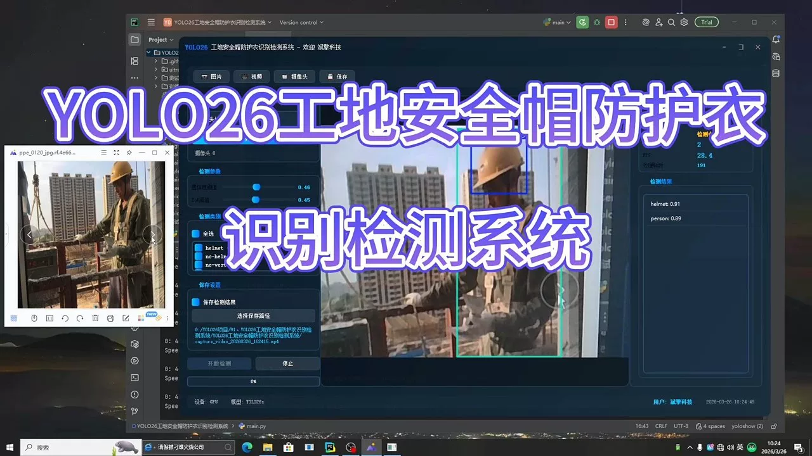
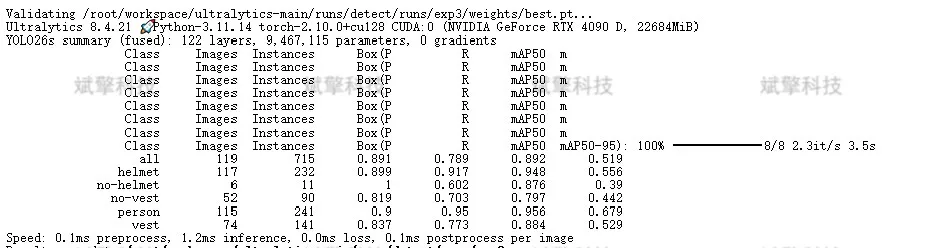
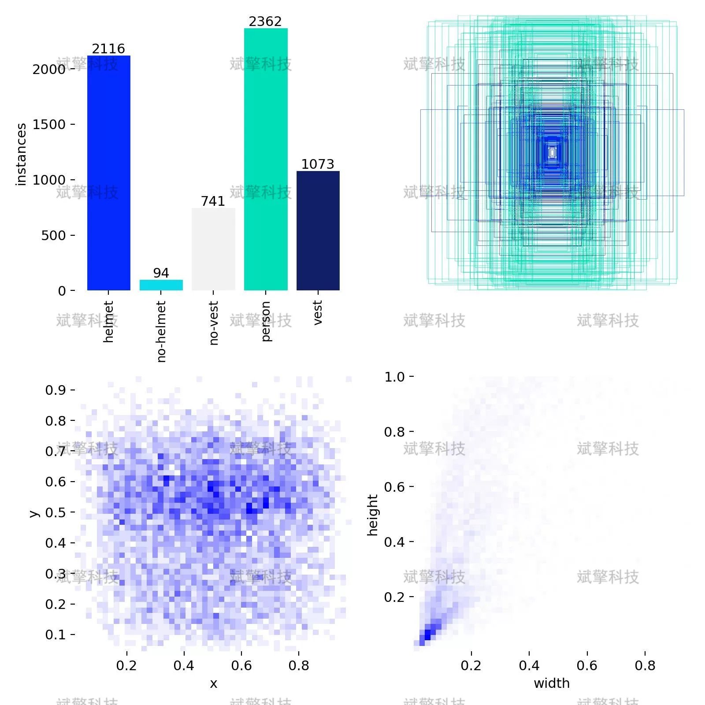
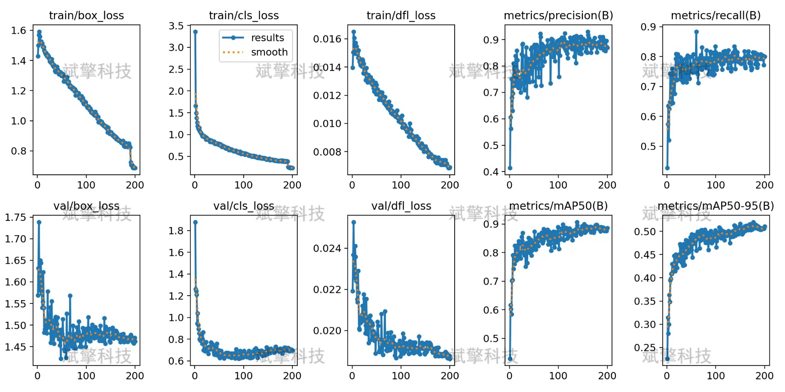
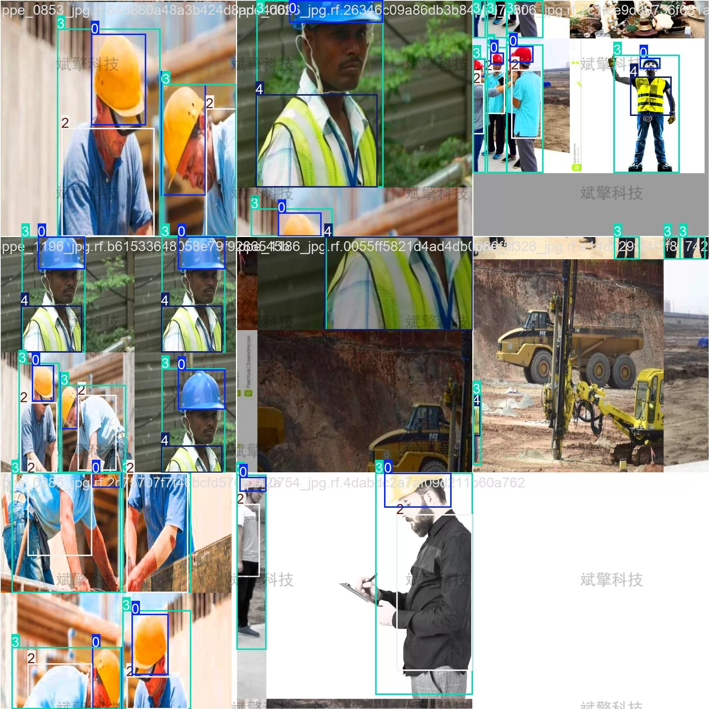
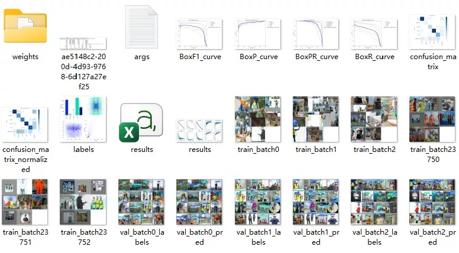
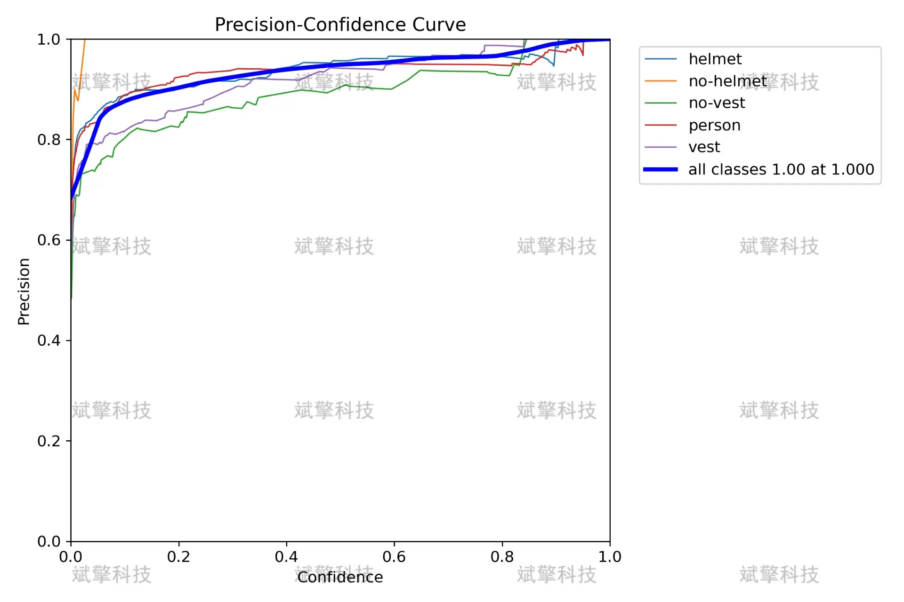
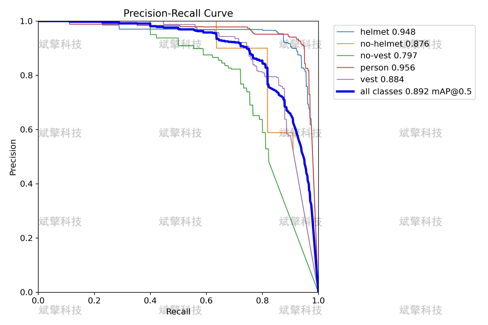
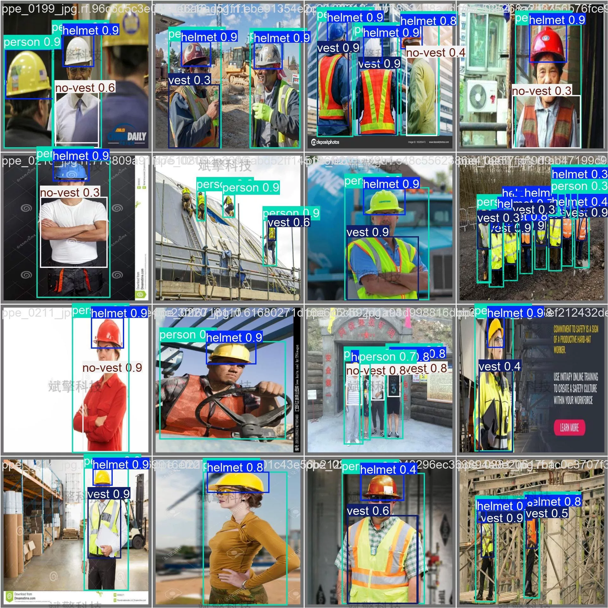

# YOLO26 construction site safety helmet and protective clothing identification detection system

## Body

YOLO26 is a new tool for construction site safety. It can identify and detect helmets and protective clothing based on YOLO26. The project source code, dataset, model weights, UI interface, Python, deep learning, and remote environment deployment are all included in this system.

In construction management, safety monitoring is an important aspect. The correct wearing of safety helmets and protective clothing directly affects the life safety of workers. This paper constructs a safety equipment recognition detection system based on the YOLO26 object detection algorithm for the construction site scene, which can automatically detect whether workers are correctly wearing safety helmets and protective clothing. The system includes five detection categories: helmet (safety helmet), no-helmet (not wearing a safety helmet), no-vest (not wearing protective clothing), person (person), vest (protective clothing). The experiment uses 1206 images from the construction site scene, divided into training set (997), validation set (119) and test set (90). After training, the model achieved excellent performance with mAP50 of 0.892 on the validation set, among which the mAP50 of the safety helmet category reached 0.948, and the person detection achieved 0.956. The inference speed reached 1.2ms/image, meeting the real-time detection requirements. The experimental results show that this system can effectively recognize the wearing situation of safety equipment in construction sites, providing a feasible technical solution for intelligent safety management in construction sites.

Dataset Size
The dataset consists of 1206 labeled images, which are divided into training set, validation set, and test set in the ratio of 8:1:1 as follows:
- Training set: 997 images, used for learning model parameters.
- Validation set: 119 images, used for adjusting model hyperparameters and performance verification.
- Test set: 90 images, used for final evaluation of model performance.

Helmet: An instance where the worker's head is correctly wearing a safety helmet.
No-helmet: An instance where the worker's head is not wearing a safety helmet.
No-vest: An instance where the worker is not wearing a protective vest (reflective vest).
Person: A basic detection target in the construction site.
Vest: An instance where the worker is correctly wearing a protective vest.

Free remote installation appointments. Unsuccessful, full refund.
Purchase includes the following resources (auto-unlocked by Baidu Pan)
YOLO recognition detection project complete source code
YOLO format datasets
Training code + UI interface code
Trained model + results images
Software installation package
Add WeChat to make a remote installation appointment (shown automatically after purchase) —— Unsuccessful, full refund

⚙️ Core Function Modules
Detection Capabilities
    Image Detection: Upon upload, returns detection boxes + category information.
    Video Detection: Supports video files, analyzes frames accurately in real-time.
    Camera Real-Time Detection: Attaches USB cameras to achieve dynamic monitoring.

️ Interaction and Control
    Target Filtering: Choose one or more categories for detection freely.
    Parameter Real-Time Adjustment: Adjustable confidence threshold & IoU threshold, flexibly control accuracy.
    Result Save: One-click save of image/video/camera detection results.

System and Data
    User Login and Registration: Supports password strength checking + encrypted storage.
    Logging: Auto-records operation and error information (with timestamp).

## Images

## Payment

Here is a pay link on Stripe ( https://buy.stripe.com/3cs8yP7sY87d0vu9AB ). Please contact me lonlonago@foxmail.com after funding $89, and I will send you a complete data files , thank you!

